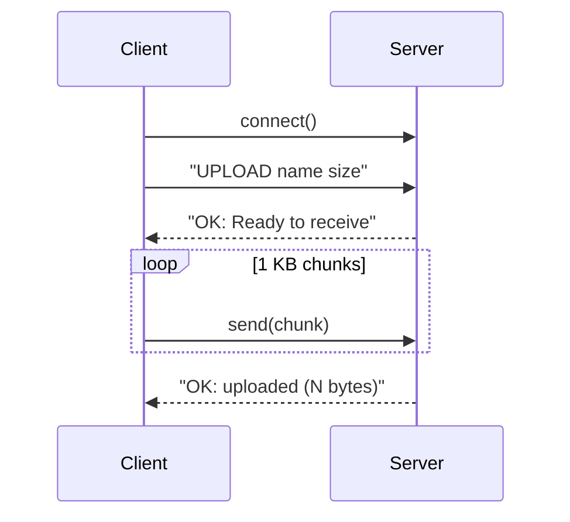

# File-Sharing System — Presentation Guide (Plain & Clear)

> Goal: explain the code so anyone can follow, without drowning in 400+ lines.
> Two programs talk to each other over a network connection: the **server** stores files, and the **client** is what a user runs to send or fetch files. They exchange short text messages (commands) and then the file data itself.

---

## Slide 0 — What this system does
- A **server** program runs on one machine and keeps files in a folder (`server_storage/`).
- A **client** program runs on another machine (or the same one) and lets a person upload, download, or list files.
- They connect through a **socket** — a network connection that lets two programs send each other data.
- Files are sent in small **chunks** (1 KB each) so even large files transfer reliably.

---

## Slide 1 — Opening the connection
**What happens:** Both programs set up a socket. The client connects to the server; the server waits for connections and handles each one.

- Server creates the socket and starts listening: [`server.py`](../server.py:182) `socket.socket(...)`, then `bind` + `listen` at [`server.py`](../server.py:186)
- Client creates a socket and connects: [`client.py`](../client.py:28) `socket.socket(...)` then `connect` at [`client.py`](../client.py:30)
- Server accepts each incoming connection: [`server.py`](../server.py:193) `accept()`

---

## Slide 2 — The command loop (the core logic)
**What happens:** The server stays connected and waits for one command at a time — `upload`, `download`, `list`, `help`, or `exit` — then runs the matching action.

- Server waits for the next command: [`server.py`](../server.py:36) `while True: command = recv(...)`
- It takes the first word and picks the action: [`server.py`](../server.py:48) `cmd = parts[0].upper()` and the choices at [`server.py`](../server.py:50)
- The client does the same when reading your typing: [`client.py`](../client.py:157) `while True:` and the check at [`client.py`](../client.py:167)

---

## Slide 3 — Uploading a file
**What happens:** The client tells the server the file name and size. The server says "ready", then the client streams the file in chunks while the server writes them to disk.

- Client sends the command with name + size: [`client.py`](../client.py:48) `UPLOAD {filename} {filesize}`
- Server confirms it's ready: [`server.py`](../server.py:96) `sendall(b"OK: Ready to receive file\n")`
- Server receives chunks until the full size arrives: [`server.py`](../server.py:102) `while bytes_received < filesize: recv(CHUNK_SIZE)`

---

## Slide 4 — Downloading a file
**What happens:** The client asks for a file. The server replies with the size, then streams the file back in chunks; the client saves it.

- Client requests the file: [`client.py`](../client.py:80) `DOWNLOAD {filename}`
- Server sends the size first: [`server.py`](../server.py:135) `sendall(f"OK {filesize}\n")`
- Server streams the file in chunks: [`server.py`](../server.py:141) `while True: chunk = f.read(CHUNK_SIZE); sendall(chunk)`
- Client receives and saves the chunks: [`client.py`](../client.py:101) `while bytes_received < filesize: recv(CHUNK_SIZE)`

---

## Slide 5 — Handling multiple users at once
**What happens:** The server can serve several clients simultaneously using threads. A **lock** makes sure two clients don't write to storage at the exact same moment and corrupt a file.

- The lock is created once: [`server.py`](../server.py:21) `file_lock = threading.Lock()`
- Every file write is protected by the lock: [`server.py`](../server.py:99) `with file_lock:` (also on download at [`server.py`](../server.py:138))
- Each client runs in its own thread: [`server.py`](../server.py:194) `threading.Thread(target=handle_client, ...)`

---

## Slide 6 — Extra commands
**What happens:** A few small commands for convenience.

- List files on the server: [`server.py`](../server.py:155) `os.listdir(STORAGE_DIR)`
- Show available commands: [`server.py`](../server.py:167) `handle_help`
- Disconnect cleanly: [`server.py`](../server.py:59) `sendall(b"OK: Goodbye.\n")`

---

## Slide 7 — How a transfer flows (one diagram)

---

## Quick glossary
- **Socket** = a network connection between two programs.
- **Chunk** = a small piece of a file sent at a time (here, 1 KB).
- **Thread** = a separate task so the server can handle many clients.
- **Lock** = a rule allowing only one client to write at a time.
- **recv / sendall** = receive / send data over the connection.

**Presenter tip:** Only ~12 lines (the bolded ones) need to be read aloud. Describe the rest as "standard setup and error handling" and keep moving.
